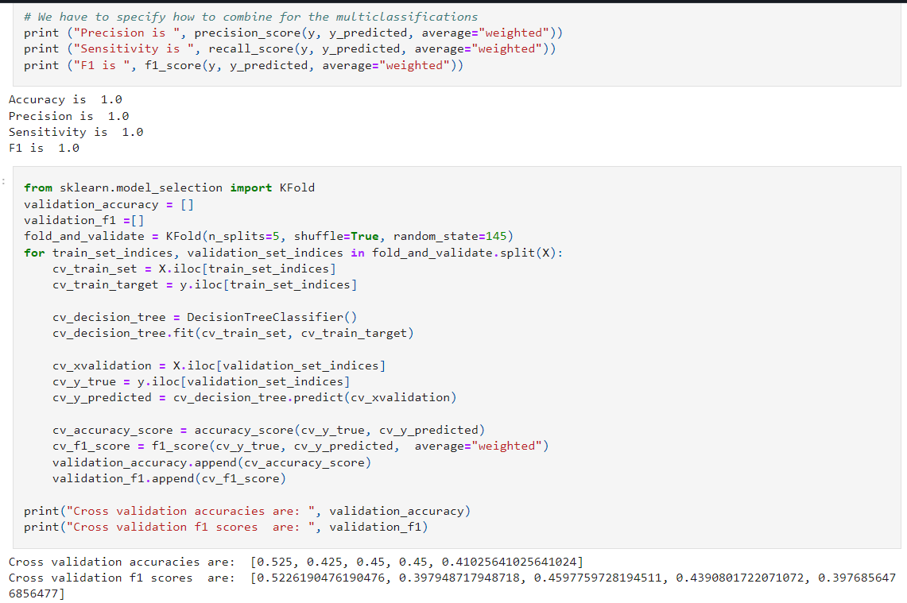
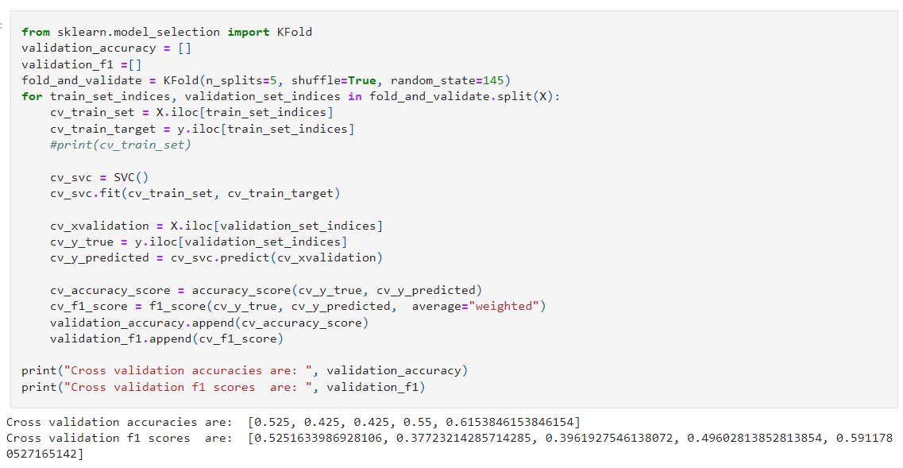
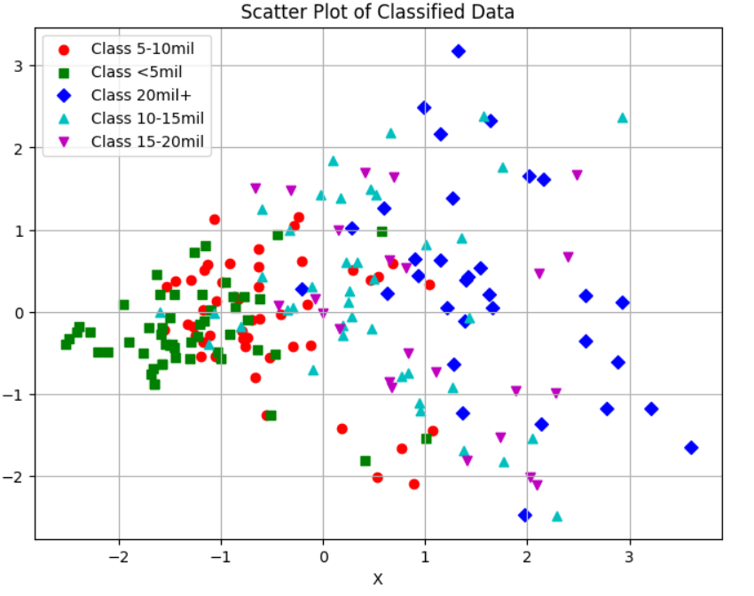
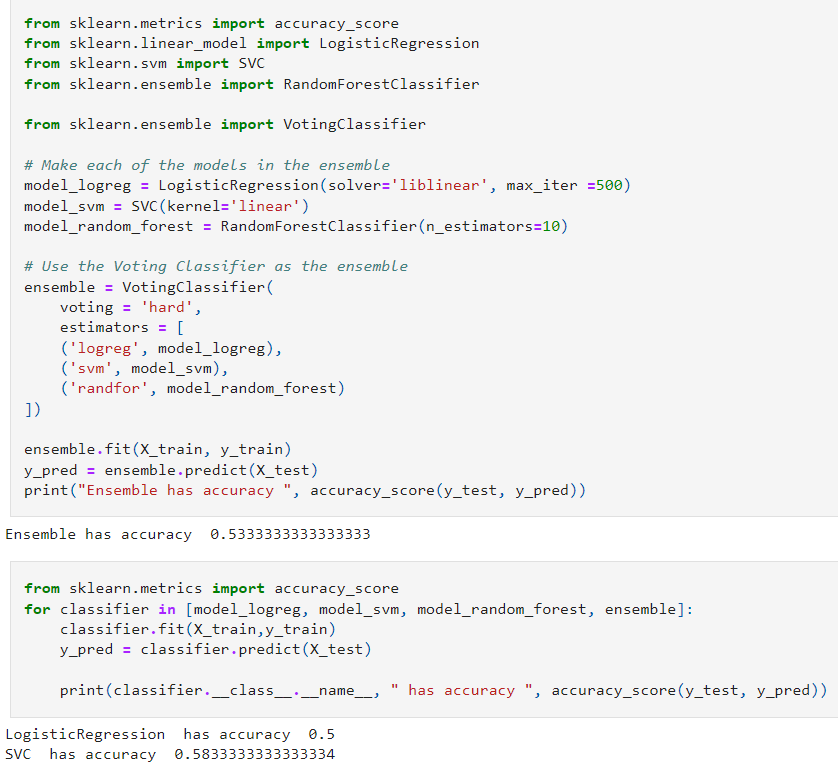

#Analysis of Data and Models

### Linear Regressions
The first thing I did with linear regression was used one feature, points per game, to determine the output of the salary. This performed better than I thought it would but also not great with a .64 r value. I was excited to see some promise with at least one of my features
so I followed with more. Based on simple predictions with points, assists, and rebounds we can get almost 70% of the predicted value determined by the input.  This is very promising for the future of the project and making actual predictions in the future.
<

     
    Linear Regression on Points per Game and Average Salary
   
  Metrics on multi-feature regression

See linear regression notebook [here](linear_regression.ipynb)

### Classification models
First I had to classify my Y category which is salary in my dataset. I chose to categorize it in $5 million increments. The exact categories are as follows: <$5, $5-$10 million, $10-15 million, $15-20 million and $20+ million. I saw overfitting when using the decision tree so that was not very useful. I believe that it overfit because on top of decision trees already being prone to overfitting I did not have a large dataset to train on so it did not have very high variance in terms of datapoints per category. When using the SVM I found the accuracy of my model sitting at around 55%. This is the most success I found in my project and I believe it is because I could use a linear kernel to get the best results.

     
    Metrics on decision tree
   
  Metrics on SVM with linear kernel

### Clustering and Random Forest
The final models I used were trying to cluster my data as well as using random forest. I did not get any good results when I used PCA to reduce the dimensionality of my data and plot it out. It did not show clear definitions of each category on the graph which makes predictions much harder on my models. I then ran a random forest and ensemble learning algorithms on my data. This lead to a 52% accuracy when cross validated for the random forest because I think the forest overfit because each tree overfit which led to an overall overfitting on the data. When I used ensemble learning I did not get anything outstanding except for the 58% accuracy that SVM got for its metrics. I was not happy to see that my models didn't not turn out well but I did learn a lot.

     
    Graph of data after PCA has been applied to decrease dimensiality 
   
  Metrics on the ensemble learning

### Improvemnts
I think that this project was not a failure but it could have been better. I think some things that could have helped were a larger dataset. A larger data set would have given my models more instances to train on and would have reduced overfitting. Another thing that could have helped was more exploration of the features I did not use and how they would have effected the accuracies of certain models.

[Conclusions](CONCLUSIONS.md)
* For source code on decision tree and svm click [here](/classification.ipynb)
* For source code on clustering and random forest click [here](/clustering.ipynb)
* [Repo]()
