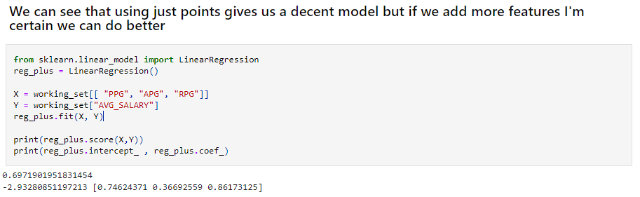

# Analysis of data and models

### Linear Regressions
The first thing I did with linear regression was used one feature, points per game, to determine the output of the salary. This performed better than I thought it would but also not great with a .64 r value. I was excited to see some promise with at least one of my features
so I followed with more. Based on simple predictions with points, assists, and rebounds we can get almost 70% of the predicted value determined by the input.  This is very promising for the future of the project and making actual predictions in the future.
<

     
    Linear Regression on Points per Game and Average Salary
   
  Metrics on multi-feature regression

See linear regression notebook [here](linear_regression.ipynb)
